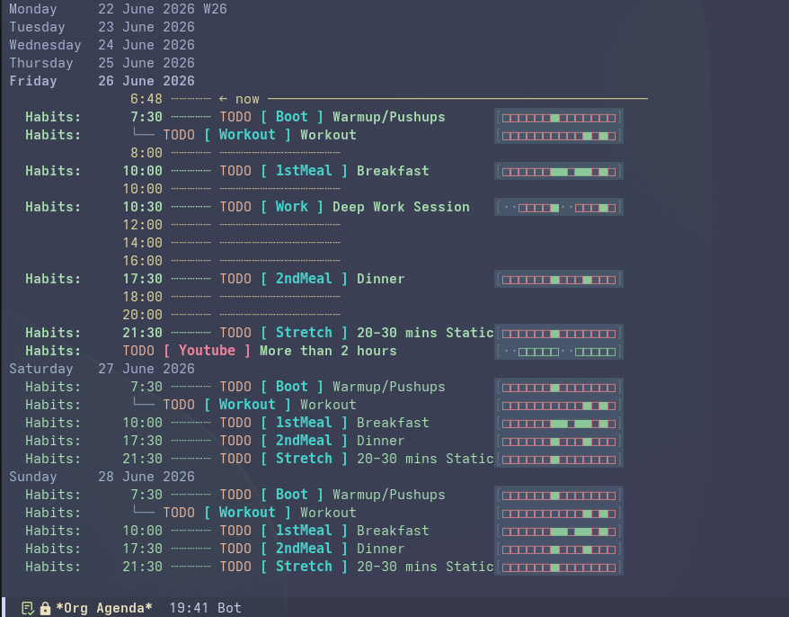

# org-atomic



`org-atomic` is a habit tracker for Emacs Org-mode. It replaces default asterisk-based `org-habit` graphs with clean Unicode blocks, and adds day groups, habit stacking, and tooltips inspired by the book _Atomic Habits_ by James Clear.

## Features

1. **Unicode Graphs**: Replaces default asterisks (`*` and `!`) with configurable Unicode blocks:
   - `■` (Done)
   - `□` (Missed)
   - `·` (Skipped / rest day)
2. **Flexible Day Groups**: Define active days (e.g., `workdays`, `weekends`, or specific weekdays). Rest days are represented as skipped (`·`) and do not break streaks.
3. **Agenda Prefixes**: Prepends a styled habit ID prefix (e.g. `[ Gym ] Strength Training`) in the Org Agenda.
4. **Habit Stacking**: Chain habits sequentially to form dependencies in the agenda view.
5. **Contextual Tooltips**: Displays prompts and cues on hover (e.g., motivation, ease triggers).

---

## Installation

### Built-in package-vc (Emacs 29+)

The recommended way for modern Emacs setups is to use the built-in package-vc:

```elisp
(use-package org-atomic
  :vc (:url "https://github.com/tmythicator/org-atomic")
  :init
  (org-atomic-mode 1))
```

### quelpa

```elisp
(use-package org-atomic
  :quelpa (org-atomic :repo "tmythicator/org-atomic" :fetcher github)
  :init
  (org-atomic-mode 1))
```

---

## How to use

Add `:STYLE: habit` to your Org entry and use the following properties:

### Core Options

- `ATOMIC_ID`: A unique ID for the habit (e.g. `Gym`). This ID is also shown as a prefix in your agenda.
- `ATOMIC_TYPE`: Set to `good` (default) or `bad` (for habits you want to avoid).
- `ATOMIC_DAYS`: Active days. Can be a group (`workdays`, `weekends`, `daily`), day numbers (`1-7` where 1 is Monday), or day names (`mon,tue`). If omitted, or set to an unrecognized name, the habit defaults to **daily** (active every day).
- `ATOMIC_NEXT`: The ID of the next habit in the stack sequence (e.g., if habit A has `:ATOMIC_NEXT: B`, habit B will stack underneath habit A).

### How org-atomic handles rest days and missed habits

In standard Org-mode, if you miss a scheduled task, it becomes "overdue" and will nag you in your agenda every single day until you mark it done. This doesn't work well for habits because rest days should be guilt-free.

To solve this, `org-atomic` does some smart behind-the-scenes filtering:

- **No guilt on rest days**: If you miss a habit on an active day (e.g., Saturday), it won't clutter your agenda on rest days (e.g., Monday).
- **Auto-resurfacing**: The missed habit will quietly wait and only show up again on your next active day (e.g., the following Saturday).
- **Clean future schedule**: Future instances of habits will only appear on their active days in your weekly or monthly agenda views, keeping your schedule clean.

### Tooltip Prompts (Atomic Habit Laws)

- `ATOMIC_WHY`: Why you want to build/avoid this habit.
- `ATOMIC_OBVIOUS` (or `ATOMIC_INVISIBLE` for bad habits): 1st Law.
- `ATOMIC_ATTRACTIVE` (or `ATOMIC_UNATTRACTIVE`): 2nd Law.
- `ATOMIC_EASY` (or `ATOMIC_HARD`): 3rd Law.
- `ATOMIC_SATISFYING` (or `ATOMIC_UNSATISFYING`): 4th Law.

### Example

```org
* TODO Strength Training [07:30 - 08:30]
  SCHEDULED: <2026-06-24 Wed .+1d>
  :PROPERTIES:
  :STYLE:             habit
  :ATOMIC_DAYS:       weekends
  :ATOMIC_ID:         Gym
  :ATOMIC_NEXT:       Shower
  :ATOMIC_WHY:        Aids flexibility
  :ATOMIC_OBVIOUS:    Leave yoga mat out on the floor
  :ATOMIC_EASY:       10 minute session
  :END:
  - State "DONE"       from "TODO"       [2026-06-21 Sun]

* TODO Cold Shower
  SCHEDULED: <2026-06-24 Wed .+1d>
  :PROPERTIES:
  :STYLE:             habit
  :ATOMIC_DAYS:       weekends
  :ATOMIC_ID:         Shower
  :ATOMIC_WHY:        Boosts recovery
  :ATOMIC_EASY:       Just 2 minutes
  :END:

> [!TIP]
> For more comprehensive examples, check out [mock-habits.org](test/fixtures/mock-habits.org).
```

---

## Customization

You can change the characters and default day groups:

```elisp
;; Define your own active day groups
(setq org-atomic-core-day-groups
      '(("workdays" 1 2 3 4 5)
        ("weekends" 6 7)
        ("daily" 1 2 3 4 5 6 7)
        ("gym-days" 1 3 5)))

;; Custom characters
(setq org-atomic-graph-done-char ?■
      org-atomic-graph-missed-char ?□
      org-atomic-graph-skipped-char ?·)

;; Exclude specific terminal states from being counted as habit completions
(setq org-atomic-core-excluded-logbook-states
      '("CANCELED" "CANCELLED" "SKIPPED" "FAILED"))
```

Faces available for customization:

- `org-atomic-graph-done-face` (default: green/blue)
- `org-atomic-graph-missed-face` (default: red/orange)
- `org-atomic-graph-skipped-face` (default: gray)
- `org-atomic-agenda-id-face` (default: teal badge)
- `org-atomic-agenda-bad-habit-face` (default: rose badge)
- `org-atomic-agenda-branch-face` (default: gray branch prefix)

---

## References & Inspiration

- [_Atomic Habits_ by James Clear](https://jamesclear.com/atomic-habits) — The core concepts of habit identity, stacking, and the four laws of behavior change are inspired by and taken directly from this book.
